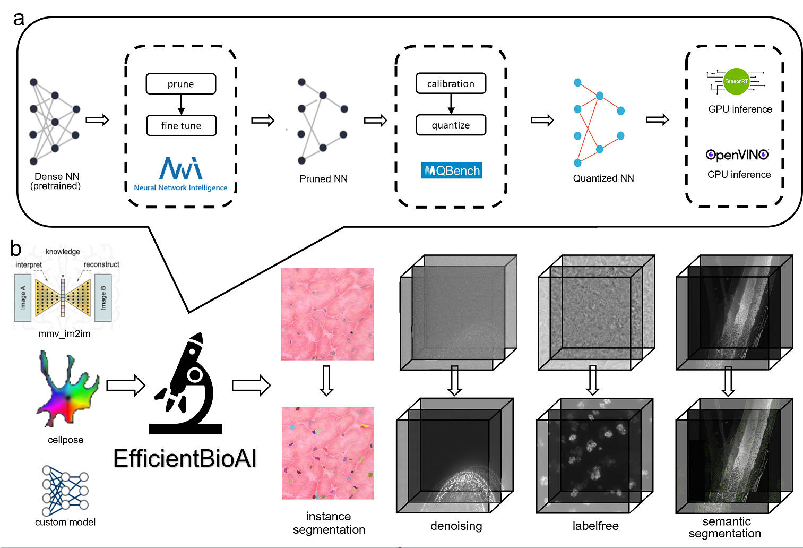

# EfficientBioAI
This package mainly focus on the efficiency (latency improvement, energy saving...) of BioImage AI tasks. For the moment we implemented quantization and pruning algorithm.

## 1. Introduction:
<p align="center">
  
</p>
<p align="center">Fig. 1: Overview of the toolbox.</p>

As illustrated by the figure above, the whole project contains two steps: compression and inference. In the first step, we prune the pretrained model and quantize it into int8 precision and then transform the model to a format suitable for the inference engine. The next step is to run the inference on the inference engine to make predictions. The inference engine that we choose is `OpenVINO` for Intel CPUs and `TensorRT` for NVIDIA GPUs.   
We support several popular bioimage AI tools like ([mmv_im2im](https://github.com/MMV-Lab/mmv_im2im),[cellpose](https://github.com/MouseLand/cellpose)), as well as user-defined PyTorch models (see our [paper](https://arxiv.org/abs/2306.06152) for details on restrictions). 

## 2. System requirements:
### Hardware:
- CPU inference: Processors with the AVX-512 Support (check [here](https://en.wikipedia.org/wiki/AVX-512#CPUs_with_AVX-512), Normally Intel Xeon® Processor Family)
- GPU inference: Nvidia GPU with int8 Support (check [here](https://docs.nvidia.com/deeplearning/tensorrt/support-matrix/index.html#hardware-precision-matrix))
### Operating System:
Linux system (Ubuntu 20.04, Debian 10) and Windows 10 are tested. At the moment, we cannot support MacOS.

### Dependencies:
- pytorch == 1.10
- [MQBench](https://github.com/ModelTC/MQBench) (for quantization)
- [nni](https://github.com/microsoft/nni) (for pruning)
- [cellpose](https://github.com/MouseLand/cellpose)
- [mmv_im2im](https://github.com/MMV-Lab/mmv_im2im) == 0.4.0
- [pycuda](https://github.com/inducer/pycuda) (required for tensorrt)
- [tensorrt](https://github.com/NVIDIA/TensorRT) (for gpu inference)
- [openvino](https://github.com/openvinotoolkit/openvino) (for cpu inference)

The dependencies will be installed automatically.

### Versions:
The stable version is 0.0.6

## 3. Installation:
### Typical installation time:
around 5 mins for linux users and 20 mins for windows users.

### Prerequisite for Windows users:
If you want to use **GPU** inference, several things should be checked:
1. Make sure the cuda and cudnn are installed properly. cuda 11.3 and cudnn 8.9.0 have been tested successfully.
2. Currently tensorrt cannot be installed from pip in windows system. Users have to install through [zip file](https://docs.nvidia.com/deeplearning/tensorrt/install-guide/index.html#installing-zip). version 8.4.3.1 is tested successfully by the author.
3. to properly install pycuda, [ms build tools](https://visualstudio.microsoft.com/visual-cpp-build-tools/) may be required.

### install from scratch:
Installation videos are here: [Linux](https://vimeo.com/878650785?share=copy#t=0), [Windows](https://vimeo.com/878674288/70320eaffb?share=copy)

First create a virtual environment using conda:
```bash
conda config --add channels conda-forge
conda create -n efficientbioai python=3.8 setuptools=59.5.0
conda activate efficientbioai
```
Then we can install the package:
```bash
git clone https://github.com/MMV-Lab/EfficientBioAI.git
# optional: give users the right to read/write/execute the setup script.
chmod 777 ./EfficientBioAI/installation/setup.sh
# for cpu: (Intel, AMD that supports AVX-512)
./EfficientBioAI/installation/setup.sh cpu
# for gpu: (NVIDIA)
./EfficientBioAI/installation/setup.sh gpu
# for both CPU and GPU:
./EfficientBioAI/installation/setup.sh all
```
For Windows users, please substitute `./EfficientBioAI/installation/setup.sh` with `.\EfficientBioAI\installation\setup.bat`

### install via Docker:

We use different Docker images for CPU and GPU. To install Docker, please check: [desktop](https://www.docker.com/get-started/), [command line](/docker/cpu/install.sh). GPU version also requires [nvidia-docker](https://docs.nvidia.com/datacenter/cloud-native/container-toolkit/latest/install-guide.html#installation) (or from [here](/docker/gpu/install.sh)) to communicate to GPU hardware. 

We recommend users to use VSCode [Docker](https://marketplace.visualstudio.com/items?itemName=ms-azuretools.vscode-docker) + [Dev Containers](https://marketplace.visualstudio.com/items?itemName=ms-vscode-remote.remote-containers) plugin to run our tutorial.

Here is the video demonstrating how to install and how to use our tool via Docker: [video tutorials for Docker versions](https://vimeo.com/878637947?share=copy).

- for CPU:
```bash
# 1. Pull the image
docker pull mmvlab/efficientbioai:cpu
# 2. Start the container. Your current folder is mounted to /mount in the container. The EfficientBioAI location is /EfficientBioAI 
docker run -it --rm --name efficientbioai_cpu --shm-size=2gb -v $(pwd):/mount -w /mount mmvlab/efficientbioai:cpu /bin/bash
```
- for CPU+GPU:
```bash
# 1. Pull the image
docker pull mmvlab/efficientbioai:all
# 2. Start the container. Your current folder is mounted to /mount in the container. The EfficientBioAI location is /workspace/EfficientBioAI 
docker run -it --rm --gpus all --name efficientbioai_all --shm-size=2gb -v $(pwd):/mount -w /mount mmvlab/efficientbioai:all /bin/bash
```

## 4. Quick Start:
There is an [example](tutorial/DecoNoising/README.md) from [ZerocostDL4Mic](https://colab.research.google.com/github/HenriquesLab/ZeroCostDL4Mic/blob/master/Colab_notebooks/Beta%20notebooks/DecoNoising_2D_ZeroCostDL4Mic.ipynb).

## 5. Tricks:
Suppose you alreadly have a pretrained model and you want to compress it using our toolkit, several things need to be satisfied:
   - The model should be in the `torch.nn.Module` format.
   - The model contains no dynamic flow (see [here](https://pytorch.org/docs/stable/fx.html#dynamic-control-flow) for more details, and [here](docs/dynamic_flow.md) for examples).
   - Avoid explicit self-defined model class member calls outside the class during the quantization process.(see [here](docs/explicit_class_member_call.md) for description and cases).
  
If satisfied, just check the `6. Instructions for use` section to see how to run the code. There is also an [example](tutorial/DecoNoising/README.md) from [ZerocostDL4Mic](https://colab.research.google.com/github/HenriquesLab/ZeroCostDL4Mic/blob/master/Colab_notebooks/Beta%20notebooks/DecoNoising_2D_ZeroCostDL4Mic.ipynb).

If not, check the following examples to see how to get rid of the problems:
   -  correct the dynamic control flow: [description](extra_class_memebers.md)
   -  get rid of the dynamic flows: [description](docs/dynamic_flow.md)

### expected run time:
- **Compression**:
  - **quantization**: PTQ will take several minutes.
  - **pruning**: pruning itself takes several minutes. Fine-tuning will take longer time based on the iterations and training data size.
- **Inference**: Latencies on several different tasks can be found in table 1 of our [preprint](https://arxiv.org/abs/2306.06152).

## 6. Instructions for use:
There are two ways to run the code. Using the provided scripts or just using the api. Both requires the config yaml file and you can find an example here: [config file example](tutorial/SemanticSeg/custom_config.yaml).
### Use script:
- compression:
```bash
python efficientbioai/compress.py --config path/to/the/config.yaml --exp_path experiment/save_path
```
All the intermediate files will be saved in the `exp_path` folder.
- inference:
```bash
python efficientbioai/inference.py --config path/to/the/config.yaml
```
### Use API:
A minium code snippet is listed as below. Basically, you need to define a calibration function for quantization and fine-tuning function for pruning. Then you can use the api to do the compression and inference.
- to compress:
```python
from pathlib import Path
from copy import deepcopy
import yaml
from efficientbioai.compress_ppl import Pipeline
from efficientbioai.utils.misc import Dict2ObjParser

# read in the data, should be iterable(dataloader, list...).
data = ... 

def calibrate(model, data, device):
    # define how the inference is done, like 'result = model(data)'
    ...
    return model
def fine_tune(model, data, device):
    # define how the training is done, like 'pl.Trainer('max_epochs'=100).fit(model, data)'
    ...
    return model

# read in the config file
cfg_path = Path("./custom_config.yaml")
with open(cfg_path, "r") as stream:
    config_yml = yaml.safe_load(stream)
exp_path = Path("./exp")
Path.mkdir(exp_path, exist_ok=True)

# do the compression:
pipeline = Pipeline.setup(config_yml)
pipeline(deepcopy(net), val_data, fine_tune, calibrate, exp_path)
pipeline.network2ir()    
```
- to inference:
```python
from efficientbioai.infer.backend.openvino import create_opv_model, create_trt_model
# for cpu:
infer_path = exp_path / "academic_deploy_model.xml"
quantized_model = create_opv_model(infer_path)
# for gpu:
infer_path = exp_path / "academic_deploy_model.trt"
quantized_model = create_trt_model(infer_path)
# Then do the inference as normal
```
### Reproduction instructions
All the supplenmentary data can be downloaded from [anonymous] (under review; upon paper acceptance, the data will be released on Zenodo), which includes all the model checkpoints, data for training and test, files for the experiment. So you can use our pretrained model to test the performance of our toolbox on the provided test data for the specific task.
